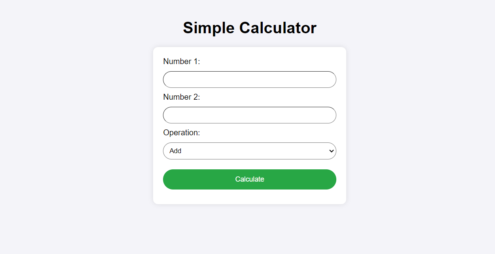

# CGI-Based Web Calculator

This project is a simple web-based calculator using **CGI (Common Gateway Interface)**. It demonstrates how to handle user input from an HTML form, process it using a Perl script on the server-side, and return the result dynamically to the user. The application supports basic arithmetic operations such as addition, subtraction, multiplication, and division.

## Screenshot

## Features

- **CGI-Enabled**: The application leverages CGI to process server-side logic using Perl.
- **Basic Arithmetic Operations**: Users can perform addition, subtraction, multiplication, and division.
- **Form Input Validation**: The input is validated to ensure that the user enters valid numbers. Division by zero is handled gracefully.
- **Cross-Browser Compatibility**: Simple and intuitive user interface compatible with most modern web browsers.
- **Perl Backend**: The server-side logic is written in Perl, which processes the form input and performs calculations.

## How It Works

1. The user enters two numbers in an HTML form.
2. The user selects the arithmetic operation (add, subtract, multiply, or divide).
3. The form sends the data to a Perl CGI script hosted on an Apache server.
4. The Perl script processes the input, performs the selected operation, and returns the result in an HTML page.

## Requirements

- **XAMPP or Apache** with CGI enabled.
- **Perl** is installed (it can be part of XAMPP or installed separately).
- Web browser (for testing the application).

## Setup Instructions

1. **Install XAMPP** and enable CGI support in the Apache server.
2. **Clone** or download this repository to your local machine.
3. Place the Perl script in the `cgi-bin` directory of your Apache server.
4. Configure the `httpd.conf` file to support the `cgi-bin` folder.
5. Open the form in a browser and test the application by navigating to `http://localhost/cgi-bin/your_script.cgi`.
  
